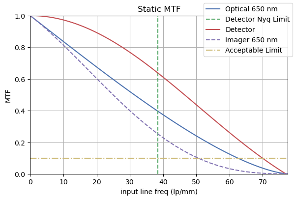

# Modelling Contrast and Sharpness Performance

## Contrast and Sharpness for an Imaging System

An imager "sees" a scene and reproduces it in an image. How faithfully contrast and sharpness information is reproduced, or conversely how much it is degraded by the overall system is a significant performance characteristic.

For example, for a (theoretical) high contrast scene with a sharp "black to white" transition, the imager will likely generate an image that takes a few or several pixels to transition from pure black to a progressively lighter grey to pure white. A good imager will need less pixels for this transition, reproducing the sharp contrast more correctly.

As a minimum, both the optics and the detector will play a role in determining the sharpness performance of the imager (though there are also other concerns like aliasing). The theoretical limit of the resolution is given by the [spatial cutoff frequency](imager_geom#spatial-cutoff-frequency) for the optics and [Nyquist Frequency / Limit](imager_geom#nyquist-frequency-Limit) for the detector. In reality, the quality of the optics as well as defocus (due to design, manufacturing, deformations under mechanical loads or thermo-elastic distortions) will result in a degraded MTF for the optics.

Furthermore, the "shaking" of the imager (for example the moving platform that the imager is mounted on, cryocoolers or other vibration sources) will degrade the sharpness. The imaging duration (or integration time) may cause motion blur if there is a relative motion between the scene and the imager. Therefore, all characteristics of the entire imaging system should be considered when modelling the overall image sharpness.

The concept of *frequency* in this context means how "quickly" consecutive pixels/regions change in contrast. For example, for a scene with black and white strips, "low frequency" means large black and white strips, whereas "high frequency" means thin black and white strips.

This is related to the concept of resolution, as the system may resolve lower frequencies, but as the frequency gets higher (and as the strips get thinner), the system will not be able to reproduce white and black - only light grey and dark grey, and for even higher frequencies, only a constant middle grey.

In practical terms, this means that a good optical system will resolve most of the detail it can theoretically resolve, whereas a bad one (low quality optics or too much vibration) will fall well short of its theoretical limits and will generate a more "muddy" image.

## Modulation Transfer Function (MTF)

Modulation Transfer Function (MTF) is a measure of how well the input "resolution" or spatial detail information is transferred through an element of the imager system. In other words, it is a measure of how much an input data of a given frequency (or level of detail) is degraded. Note that, MTF is defined for sine-wave targets and Contrast Transfer Function (CTF) is defined for square-wave targets. CTF is usually higher than MTF.

While MTF can be defined for just the optics and the detector of an imager in a narrow sense, other factors such as vibrations (usually called jitter) can be modelled as an MTF contributor. All MTF contributors are combined to generate the system MTF, representing how well the input frequency be reproduced in the final image. 100% MTF would mean that the scene would be perfectly reproduced in the image.

Even though MTF can be evaluated as a single value for a single input line frequency, it is more useful to evaluate it as the plot of possible line frequencies, starting from low frequencies (usually corresponding to high MTF values) to higher frequencies (usually with decreasing MTF values), all the way to the Nyquist limit of the detector, which sets the practical limit of the resolution. The following plot shows the Optics, Detector and the resulting Imager MTF decrease with the increasing input line frequency, as well as the Nyquist limit.

A rule of thumb is that the resolution limit of the system is at the frequency for which the MTF is equal to 0.1[^1].

As can be imagined, the ratio of the optics limits to the resolution compared to the detector limits is a useful metric as to how good the output images will *theoretically* be. The equation is given simply as the ratio of the spatial cut-off frequency to the Nyquist limit, or for the given wavelength, the ratio of the F-number to the pixel pitch.

$$ Q = \frac {\lambda F_\#}{ \text{pix pitch}}  $$

It is desirable to have the Q value between 1 and 2. Below 1, the images are undersampled. Beyond 2, the image may become too blurry. The emphasis on *theoretically* should be noted, as the equation does not take into account optics defects like defocussing or surface imperfections. Nor does it take into account the real-world effects that cause blurring, such as vibrations.

It should also be noted that, MTF can be defined in different directions. For example, optical imperfections may vary in tangential and sagittal directions (e.g., focus fall towards the edges of a lens) or motion blur will result in lower MTF in the direction of the motion.

## Static Contributors to the MTF

### Optical MTF

#### Ideal Optical MTF

The *ideal* optical MTF for a clear circular diffraction-limited aperture with monochromatic illumination is given as[^2]:

$$\text{MTF}(f) = \frac{2}{\pi} \left[ \arccos \left( \frac{f}{f_c} \right) - \frac{f}{f_c}  \sqrt{1- \left( \frac{f}{f_c} \right)^2} \right]$$

where $f$ is the input line frequency and $f_c$ is the spatial cutoff frequency.

This can also be written as:

$$\text{MTF}(f) = \frac{2}{\pi} \left[ \arccos(\nu) - \nu \sqrt{1- (\nu)^2} \right]$$

where $\nu =\left( \frac{f}{f_c} \right) $.

An alternative formulation is:

$$\text{MTF}(f) = \frac{2}{\pi} \left[ \psi - \cos(\psi) \sin(\psi) \right]$$

where $\psi$ is equal to $\arccos(\nu)$.

The MTF value (or the curve) is wavelength dependent. The optical MTF is usually expressed either as multiple curves for each wavelength within the limits of the imager (for example red, green and blue for a colour imager) or as a single curve with the weighted average of multiple curves.

The real optical MTF will be lower than this value, due to real world design limitations, materials, manufacturing, integration as well as mechanical and thermal loads. This is usually simulated in a software like Zemax and eventually measured in the lab.

#### Aberration Transfer Factor (ATF) and Aberrated Optical MTF

The Aberration Transfer Factor[^3] (ATF) is an empirical model that combines all sources of optical aberrations into a single total wavefront error:

$$\text{ATF}(f) = 1- \left( \frac{W_{RMS}}{0.18} \right)^2 \left[ 1 - 4 ( \nu -0.5 )^2 \right] $$

where $W_{RMS}$ is the RMS of the total wavefront error, or how much the actual wavefront deviates from the ideal wavefront. The unit of this deviation is the multiple wavelengths. For $W_{RMS} = 0$, ATF is equal to 1 for all input frequencies, corresponding to no optical aberrations.

All aberration sources are (RMS) summed and then the resulting wavelength error can be inserted in the ATF to compute the total ATF of the optical system.

$$\text{MTF}_{true}(f) = \text{MTF}_{ideal}(f) \times \text{ATF}(f) $$  

Multiplying the ATF value with the ideal optical MTF, we can reach the more realistic MTF with the aberrations. As the $W_{RMS}$ value increases, the ATF value decreases and the resulting MTF also decreases, corresponding to a degradation in image quality.

Some sample fabrication tolerances are given [here](https://www.telescope-optics.net/fabrication.htm). For example, surface roughness for Commercial Optics can be a single wavelength (Peak-to-Valley), whereas for Precision Optics it could be about quarter of a wavelength and for High Precision Optics it could be as low as 5% of a wavelength. Satellite imagers would also be as high as 5% of a wavelength.

### Detector Sampling MTF

Each detector (or a single pixel of the detector) performs spatial averaging of the irradiance, or more precisely, we integrate the irradiance with the detector responsivity, over the detector area (See [here](https://spie.org/publications/spie-publication-resources/optipedia-free-optics-information/tt52_21_detector_footprint_mtf) for more information). In the frequency domain this corresponds to:

$$\text{MTF}(f) = \frac{\sin(\pi p f)}{\pi p f} = \text{sinc}(p f)$$

where $p$ is equal to pixel pitch. As the frequency increases, the pixels cannot represent the sine wave properly and there is a reduction in modulation. At a line frequency corresponding to the inverse of the pixel pitch, modulation goes down to zero, as the input sine wave is completely inside the pixel pitch. Even higher input frequencies will then be completely undersampled. This results in contrast reversal and MTF values will be negative.

## Dynamic Contributors to the MTF

Dynamic MTF is the broad name given to multiple sources of image sharpness loss, commonly due to a "shaking" of the imager or a relative motion between the imager and the platform. This results in the loss of sharpness; sometimes manifesting itself as blurring roughly equal in all directions and sometimes as a directional smear in the image.

Depending on the imaging setting, one or more of the following sources can be present:

- Motion blur: Relative motion between the imager and the scene *during the exposure duration*, causing a smear on the image.
- Jitter: High frequency random imager shake *during the exposure duration*, causing a blur on the image.
- Drift/smear: Directional imager drift *during the exposure duration*, causing a smear on the image.

Motion blur is prominent in satellite imagers at Low Earth Orbit (as opposed to Geosynchronous Orbit) and aircraft, both of which fly over the target. Jitter is prominent in all imagers attached to equipment that generates high frequency vibration sources, such as engines in aircraft or reaction wheels in satellites. Cryocoolers with pistons also introduce vibrations close to the detector. Drift/smear is prominent in imagers that are not physically fixed to a stable platform and/or with relatively long exposures where the slow shaking of the imaging platform becomes visible.

The common theme in all these sources is the exposure duration. Generally speaking, vibration sources with a period much shorter than (or a frequency higher than) the exposure duration are called jitter and they cause random artefacts such as blurring. The detector pixel captures information from around neighbouring areas in all directions, rather than the area corresponding to what the pixel would normally "see". Vibration sources with a frequency close to exposure duration cannot complete multiple cycles (or even a single cycle) during the exposure duration, therefore they cause a drift/smear in the direction they apply. The vibration sources with periods much longer than the exposure duration have no significant impact on the sharpness (or MTF).

It follows that the same vibration sources may cause different type of artefacts for different exposure durations. As the exposure duration becomes longer, even low frequency vibration sources start causing blur (rather than smear), and very slow motion sources start causing smear. For a 10 ms exposure (or "1/100" s in photography terms and 100 Hz in frequency terms), a 1000 Hz (1 ms) vibration source would cause jitter. A 50 Hz (20 ms) vibration source would cause a drift. A 1 Hz (1 s) vibration source would be too slow to impact the imaging quality (though the image shake would be visible in a video). If the exposure is increased to 100 ms (10 Hz), both 1000 Hz and 50 Hz vibration sources would cause jitter and the 1 Hz vibration source could cause drift/smear.

While it may then sound tempting to reduce the exposure duration to maximise the sharpness, it also controls the number of photons received, and therefore a lot of critical parameters, chiefly Signal-to-Noise Ratio (SNR): the longer is the exposure, usually the better is the SNR (up to saturation level). Therefore, the exposure duration needs to be optimised between the image sharpness and SNR needs.

The discussion above is valid for most usecases, where single images are generated that are independent from each other. However, if the images of the same location need to be combined to create another image (e.g., Time Delay Integration (TDI) applications), then the images should match exactly and the same pixel in the consecutive images should "see" the same area on the ground. In reality, this is not possible, and the jitter as well as drift/smear within the *total combined imaging duration* (e.g., the total TDI column duration) will also impact the total imaging sharpness.

Continuing from the example above with the 10 ms exposure duration, if we introduce a 5 stage TDI, then the imager should stay stable not only for just the 10 ms exposure duration, but also within the 50 ms total TDI column duration. The jitter and drift/smear within this total TDI column duration will also introduce a loss in sharpness.

When computing the *total* MTF for the system, all the relevant contributors should be combined and must be then multiplied with the Static or Imager MTF. Therefore all the contributors should be thought together and trade-offs will have to be considered for the overall Imaging System, including the Imager and the Platform that the Imager is mounted on. As an example, the following are some practical considerations when designing an Imaging System:

- Using an excellent imager on an unstabilised platform may result in mediocre image quality.
- Using a detector with better Quantum Efficiency (or optics with better transmission) may result in shorter exposure durations and/or TDI stages, resulting in better image sharpness.
- As the jitter and drift is measured in the percentage of the detector pixel size, binning the pixels will increase the effective pixel size and reduce the relative error, yielding sharper images, albeit at reduced image resolution.  

### Motion Blur

Motion blur is caused by the relative motion between the scene and the imager during the exposure time. It is in the direction of relative motion.

In some cases, the imager is looking at a static scene (no relative motion), but a target within the scene may be moving with respect to the imager. If the target is moving appreaciably during the exposure time (for example 0.1 pixels) then the target has a motion blur. In other cases, the imager may move with respect to the scene *by design*, usually in a scanning scheme. Examples could be aircraft or low altitude satellites flying over a scene. In this case, the motion blur is strictly in the scanning direction - usually in the alongtrack direction.

Focussing on the latter case, where the entire scene is moving with respect to the imager, motion blur introduces its own MTF. However, as the resulting blurring is directional, so is the MTF.

The MTF due to motion blur is given as:

$$\text{MTF}(f) = \frac{\sin(\pi p f)}{\pi p f} = \text{sinc}(p f)$$

only in ALT direction for sats?
practical examples!!!

--------------------------------------------------

integ_time_ratio = timings.integration_duration /  (timings.frame_duration * channel.binning)

a_fx = (pixel_pitch * input_line_freq / u.lp).to_reduced_units()

sinc((integ_time_ratio*a_fx).m)

--------------------------------------------------

### Jitter

practical examples!!!

### Drift/Smear

practical examples!!!

- Yaw steering error (Single Image and TDI)
- Frame rate error (TDI)

[^1]: A Tutorial on Electro-Optical/Infrared (EO/IR) Theory and Systems; G. M. Koretsky, J. F. Nicoll, M. S. Taylor; Institute for Defense Analyses, IDA Document D-4642, 2013.

[^2]: The Infrared & Electro-Optical Systems Handbook; J. S. Accetta, David L. Shumaker (Ed.);  Infrared Information Analysis Center, 1993.

[^3]: The Art and Science of Optical Design; R. R. Shannon;  Cambridge University Press; 1997.
