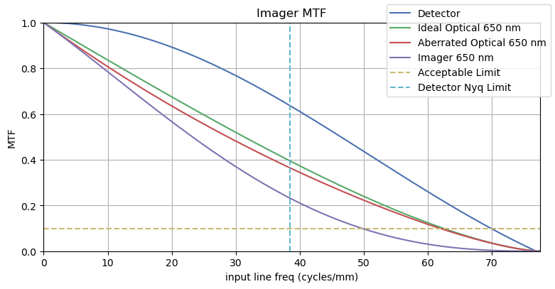

# Modelling Contrast and Sharpness Performance

## Contrast and Sharpness for an Imaging System

An imager "sees" a scene and reproduces it in an image. How faithfully contrast and sharpness information is reproduced, or conversely how much it is degraded by the overall system is a significant performance characteristic.

For example, for a (theoretical) high contrast scene with a sharp "black to white" transition, the imager will likely generate an image that takes a few or several pixels to transition from pure black to a progressively lighter grey to pure white. A good imager will need less pixels for this transition, reproducing the sharp contrast more correctly.

As a minimum, both the optics and the detector will play a role in determining the sharpness performance of the imager (though there are also other concerns like aliasing). The theoretical limit of the resolution is given by the [spatial cutoff frequency](imager_geom#spatial-cutoff-frequency) for the optics and [Nyquist Frequency / Limit](imager_geom#nyquist-frequency-Limit) for the detector. In reality, the quality of the optics as well as defocus (due to design, manufacturing, deformations under mechanical loads or thermo-elastic distortions) will result in a degraded MTF for the optics.

Furthermore, the "shaking" of the imager (for example the moving platform that the imager is mounted on, cryocoolers or other vibration sources) will degrade the sharpness. The imaging duration (or integration time) may cause motion blur if there is a relative motion between the scene and the imager. Therefore, all characteristics of the entire imaging system should be considered when modelling the overall image sharpness.

The concept of *frequency* in this context means how "quickly" consecutive pixels/regions change in contrast. For example, for a scene with black and white strips, "low frequency" means large black and white strips, whereas "high frequency" means thin black and white strips.

This is related to the concept of resolution, as the system may resolve lower frequencies, but as the frequency gets higher (and as the strips get thinner), the system will not be able to reproduce white and black - only light grey and dark grey, and for even higher frequencies, only a constant middle grey.

In practical terms, this means that a good optical system will resolve most of the detail it can theoretically resolve, whereas a bad one (low quality optics or too much vibration) will fall well short of its theoretical limits and will generate a more "muddy" image.

## Modulation Transfer Function (MTF)

Modulation Transfer Function (MTF) is a measure of how well the input "resolution" or spatial detail information is transferred through an element of the imager system. In other words, it is a measure of how much an input data of a given frequency (or level of detail) is degraded. Note that, MTF is defined for sine-wave targets and Contrast Transfer Function (CTF) is defined for square-wave targets. CTF is usually higher than MTF.

While MTF can be defined for just the optics and the detector of an imager in a narrow sense, other factors such as vibrations (usually called jitter) can be modelled as an MTF contributor. All MTF contributors are combined to generate the system MTF, representing how well the input frequency be reproduced in the final image. 100% MTF would mean that the scene would be perfectly reproduced in the image.

While MTF can be evaluated as a single value for a single input line frequency, it is more useful to evaluate it as the plot of possible line frequencies, starting from low frequencies (usually corresponding to high MTF values) to higher frequencies (usually with decreasing MTF values), all the way to the Nyquist limit of the detector, which sets the practical limit of the resolution. The following plot shows the Optics, Detector and the resulting Imager MTF decrease with the increasing input line frequency, as well as the Nyquist limit.

A rule of thumb is that the resolution limit of the system is at the frequency for which the MTF is equal to 0.1[^1].

As can be imagined, the ratio of the optics limits to the resolution compared to the detector limits is a useful metric as to how good the output images will *theoretically* be. The equation is given simply as the ratio of the spatial cut-off frequency to the Nyquist limit, or for the given wavelength, the ratio of the F-number to the pixel pitch.

$$ Q = \frac {\lambda F_\#}{ \text{pix pitch}}  $$

It is desirable to have the Q value between 1 and 2. Below 1, the images are undersampled. Beyond 2, the image may become too blurry. The emphasis on *theoretically* should be noted, as the equation does not take into account optics defects like defocussing. Nor does it take into account the real-world effects that cause blurring, such as vibrations.

## Contributors to the Modulation Transfer Function (MTF)

### Optical MTF

#### Ideal Optical MTF

The *ideal* optical MTF for a clear circular diffraction-limited aperture with monochromatic illumination is given as[^2]:

$$\text{MTF}(f) = \frac{2}{\pi} \left[ \arccos \left( \frac{f}{f_c} \right) - \frac{f}{f_c}  \sqrt{1- \left( \frac{f}{f_c} \right)^2} \right]$$

where $f$ is the input line frequency and $f_c$ is the spatial cutoff frequency.

This can also be written as:

$$\text{MTF}(f) = \frac{2}{\pi} \left[ \arccos(\nu) - \nu \sqrt{1- (\nu)^2} \right]$$

where $\nu =\left( \frac{f}{f_c} \right) $.

An alternative formulation is:

$$\text{MTF}(f) = \frac{2}{\pi} \left[ \psi - \cos(\psi) \sin(\psi) \right]$$

where $\psi$ is equal to $\arccos(\nu)$.

The MTF value (or the curve) is wavelength dependent. The optical MTF is usually expressed either as multiple curves for each wavelength within the limits of the imager (for example red, green and blue for a colour imager) or as a single curve with the weighted average of multiple curves.

The real optical MTF will be lower than this value, due to real world design limitations, materials, manufacturing, integration as well as mechanical and thermal loads. This is usually simulated in a software like Zemax and eventually measured in the lab.

#### Aberration Transfer Factor (ATF) and Aberrated Optical MTF

The Aberration Transfer Factor[^3] (ATF) is an empirical model that combines all sources of optical aberrations into a single total wavefront error:

$$\text{ATF}(f) = 1- \left( \frac{W_{RMS}}{0.18} \right)^2 \left[ 1 - 4 ( \nu -0.5 )^2 \right] $$

where $W_{RMS}$ is the RMS of the total wavefront error, or how much the actual wavefront deviates from the ideal wavefront. The unit of this deviation is the multiple wavelengths. For $W_{RMS} = 0$, ATF is equal to 1 for all input frequencies, corresponding to no optical aberrations.

All aberration sources are (RMS) summed and then the resulting wavelength error can be inserted in the ATF to compute the total ATF of the optical system.

$$\text{MTF}_{true}(f) = \text{MTF}_{ideal}(f) \times \text{ATF}(f) $$  

Multiplying the ATF value with the ideal optical MTF, we can reach the more realistic MTF with the aberrations. As the $W_{RMS}$ value increases, the ATF value decreases and the resulting MTF also decreases, corresponding to a degradation in image quality.

Some sample fabrication tolerances are given [here](https://www.telescope-optics.net/fabrication.htm). For example, surface roughness for Commercial Optics can be a single wavelength (Peak-to-Valley), whereas for Precision Optics it could be about quarter of a wavelength and for High Precision Optics it could be as low as 5% of a wavelength.

### Detector Sampling MTF

[^1]: A Tutorial on Electro-Optical/Infrared (EO/IR) Theory and Systems; G. M. Koretsky, J. F. Nicoll, M. S. Taylor; Institute for Defense Analyses, IDA Document D-4642, 2013.

[^2]: The Infrared & Electro-Optical Systems Handbook; J. S. Accetta, David L. Shumaker (Ed.);  Infrared Information Analysis Center, 1993.

[^3]: The Art and Science of Optical Design; R. R. Shannon;  Cambridge University Press; 1997.
